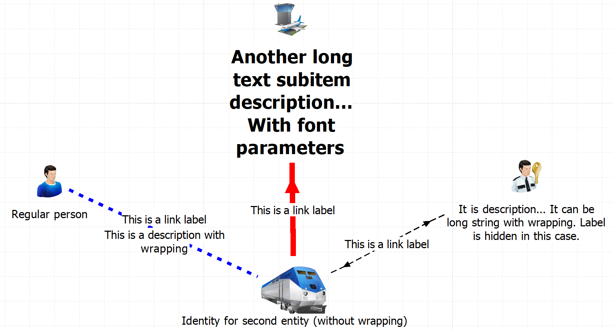

# Simplest IBM i2 Analyst Notebook chart generator

## App description

The simplest graph generator for IBM i2 Analyst Notebook. Without attributes, time dependencies and many other features. Only adding nodes, their connections and general formatting (icon size, font settings, color of connections)

Built-in entity types:
- Person
- PersonFirst
- PersonSecond
- PersonOther
- Car
- Plate
- Van
- Bus
- Train
- Plane
- CheckPoint

Possible entity size:
- ICEnlargeHalf (1/2)
- ICEnlargeSingle (x1)
- ICEnlargeDouble (x2)
- ICEnlargeTriple (x3)
- ICEnlargeQuadruple (x4)

Possible link strength:
- Confirmed
- Tentative
- Unconfirmed

Possible arrows:
- ArrowNone
- ArrowOnBoth
- ArrowOnHead
- ArrowOnTail

Possible link types (colors):
- Link (black)
- Fly (red)
- Car (blue)
- Walk (green)
- Use (purple)

Presets can be supplemented.

## Example



## Methods

Add node:
```python
    def add_entity(self,
                   anb_type: str,
                   entity_id: int,
                   entity_identity: str,
                   entity_label: str = '',
                   entity_desc: str = '',
                   icon_size: str = 'ICEnlargeSingle',
                   show_label: bool = False,
                   show_description: bool = True,
                   wrap_subitem: bool = True,
                   wrap_width: float = 1.9685039370078741,
                   font_bold: bool = False,
                   font_size: int = 11):
```

Add edge:
```python
    def add_link(self,
                 id1: int,
                 id2: int,
                 entity_label: str = '',
                 show_label=True,
                 entity_desc: str = '',
                 show_description=False,
                 wrap_subitem=True,
                 wrap_width=1.9685039370078741,
                 width=1,
                 strength='Confirmed',
                 link_type='Link',
                 arrow='ArrowNone'):
```

Save:
```python
    def save_file(self, file: Union[str, Path]):
        """Generate IBM i2 ANB file (*.anx)"""
```